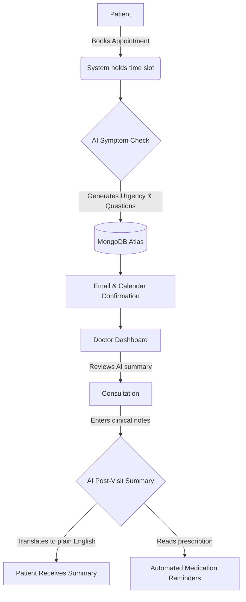

# CareFlow: Healthcare Appointment & Follow-up Manager

**Live Application:** [https://careflowproj.vercel.app/](https://careflowproj.vercel.app/)

CareFlow is a modern healthcare appointment system that simplifies scheduling, visit preparation, and follow-up care. It uses artificial intelligence to summarize patient symptoms before a visit and translates clinical notes into simple instructions after the visit.

## Application Architecture and Flow

The following diagram illustrates how data moves through the CareFlow system during a standard patient lifecycle.

## Step-by-Step Application Flow

### 1. Patient Registration and Booking
The patient logs into the application, searches for a doctor based on their specialty, and selects a time slot. To prevent double-booking, the system temporarily locks the slot for five minutes. The patient is then prompted to describe their current symptoms.

### 2. Pre-Visit AI Screening
Once the patient submits their symptoms, the system securely forwards the text to an AI model. The AI evaluates the symptoms to determine an urgency level (Low, Medium, or High) and generates three targeted questions for the doctor to ask during the consultation. The appointment is saved to the database, Google Calendar events are synchronized, and HTML confirmation emails are dispatched.

### 3. The Doctor's Workspace
The doctor logs into their dedicated dashboard to review their daily schedule. Before the patient enters the room, the doctor can read the AI-generated urgency and symptom summary, allowing them to prepare for the consultation efficiently.

### 4. Post-Visit Processing
After the consultation concludes, the doctor types their raw clinical notes and any specific medication instructions into the system. The AI processes these medical notes and translates them into a simple, patient-friendly summary without complex medical jargon.

### 5. Automated Follow-up
The system emails the translated summary directly to the patient. If the doctor provided a prescription schedule (for example, "take twice a day"), the background system automatically calculates the intervals and sends medication reminder emails to the patient precisely when they are due.

### 6. Clinic Administration
A dedicated administrator account can add new doctors to the platform. The administrator can also mark a doctor as being on leave for a specific date. When this happens, the system automatically finds all appointments booked for that day, cancels them, and emails the affected patients with an explanation.

## Technical Stack

* **Frontend:** Vanilla JavaScript single-page application.
* **Backend:** Node.js with Express.
* **Database:** MongoDB Atlas (managed via Mongoose).
* **AI Integration:** OpenRouter API (utilizing the Nemotron model).
* **Email Provider:** Resend SMTP.
* **Deployment:** Vercel (utilizing Serverless Functions and Vercel Cron for the background reminder workers).

## Local Development Setup

1. Clone the repository and navigate to the project directory.
2. Run `npm install` in the root directory to install all dependencies.
3. Create a `.env` file in the root directory and add your secret keys (MongoDB URI, Resend SMTP credentials, OpenRouter API key, and a secure JWT secret).
4. Run `npm run dev` to start the local server.
5. The system will automatically seed the database with demo accounts (patient, doctor, and admin) on the first run.
6. Open your browser to the local port indicated in the terminal to access the application.
